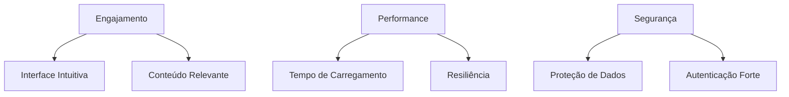

# ✨ Newgram - Uma Plataforma Moderna de Compartilhamento e Conexão

<div align="center">
  
  <p>Conectando pessoas através de conteúdos significativos</p>
  
  
  
  
</div>

## 🌟 Destaques do Projeto

<div align="center">
  
| 🚀 Tecnologias Avançadas | 💡 Recursos Inovadores | 🛡️ Segurança |
|-------------------------|-----------------------|--------------|
| Angular 16 com Signals | Feed Inteligente | JWT Authentication |
| Spring Boot 3.x | Recomendações Personalizadas | Spring Security |
| Tailwind CSS | Interações em Tempo Real | Data Protection |
| PostgreSQL | Favoritos Inteligentes | Rate Limiting |

</div>

## 📑 Índice Rápido
- [✨ Visão Geral](#-visão-geral)
- [🛠️ Tecnologias](#️-tecnologias)
- [🎯 Funcionalidades](#-funcionalidades)
- [🚀 Começando](#-começando)
  - [📋 Pré-requisitos](#-pré-requisitos)
  - [⚙️ Configuração](#️-configuração)
- [🌐 API](#-api)
- [🤝 Como Contribuir](#-como-contribuir)
- [📜 Licença](#-licença)
- [📬 Contato](#-contato)

## ✨ Visão Geral

O Newgram redefine a experiência de compartilhamento de conteúdo, oferecendo:

- **Conexões autênticas** baseadas em interesses compartilhados
- **Descoberta inteligente** com algoritmos de recomendação
- **Performance excepcional** graças à arquitetura moderna
- **Experiência fluida** em qualquer dispositivo

### 🎯 Objetivos Estratégicos



## 🛠️ Tecnologias

### Backend (Poder e Robustez)
- **Java 17** - Tipagem forte e performance
- **Spring Boot 3** - Produtividade acelerada
- **PostgreSQL** - Confiabilidade em dados
- **Flyway** - Migrações de banco versionadas
- **WebSocket** - Comunicação em tempo real

### Frontend (Elegância e Interação)
- **Angular 16** - Componentes reativos
- **Tailwind CSS** - Design utilitário
- **Angular Material** - UI consistente
- **RxJS** - Programação reativa
- **Chart.js** - Visualização de dados

## 🎯 Funcionalidades

### 🔑 Autenticação Avançada
- Fluxo OAuth2 integrado
- Autenticação multifator
- Gerenciamento de sessões

### 🌍 Exploração de Conteúdo
- **Feed algorítmico** - Aprende com suas interações
- **Busca semântica** - Encontre o que realmente importa
- **Coleções temáticas** - Conteúdo organizado por tópicos

### ❤️ Sistema de Favoritos
- Tags inteligentes
- Organização visual
- Sincronização cross-device

## 🚀 Começando

### 📋 Pré-requisitos
- Docker (recomendado)
- Java 17+
- Node 18+
- PostgreSQL 15+

## Instalação

### Backend

1. Clone o repositório:

```bash
git clone https://github.com/JamesonHenrique/Newgram.git
cd newgram
```

2. Configure o banco de dados PostgreSQL no arquivo `src/main/resources/application.properties`

3. Execute o backend:

```bash
mvn spring-boot:run
```

O servidor estará disponível em `http://localhost:8080`

### Frontend

1. Navegue até a pasta do frontend:

```bash
cd newgram-ui
```

2. Instale as dependências:

```bash
npm install
```

3. Execute o frontend:

```bash
ng serve
```

A aplicação estará disponível em `http://localhost:4200`

## 🌐 API

A documentação da API está disponível através do Swagger UI:

```
http://localhost:8080/swagger-ui.html
```

Principais endpoints:

| Método | Endpoint | Descrição |
|--------|----------|-----------|
| POST | `/auth/login` | Autenticação |
| GET | `/content?tags=` | Busca filtrada |
| PUT | `/favorites/{id}` | Gerencia favoritos |

## 🤝 Como Contribuir

Siga nosso fluxo de colaboração:

1. Crie uma issue descrevendo sua proposta
2. Faça fork do projeto
3. Crie um branch descritivo (`feat/new-auth-flow`)
4. Envie seu PR com:
   - Descrição clara
   - Screenshots (se aplicável)
   - Testes atualizados

## 📜 Licença

MIT License - Veja o arquivo [LICENSE](LICENSE) para detalhes.

## 📬 Contato

**Jameson Henrique**  
[](https://linkedin.com/in/JamesonHenrique)  
[](mailto:jamesonhenrique14@email.com)

---

<div align="center">
  <p>Gostou do projeto? Deixe uma ⭐ no repositório!</p>
  <a href="#✨-newgram---uma-plataforma-moderna-de-compartilhamento-e-conexão">↑ Voltar ao topo ↑</a>
</div>
