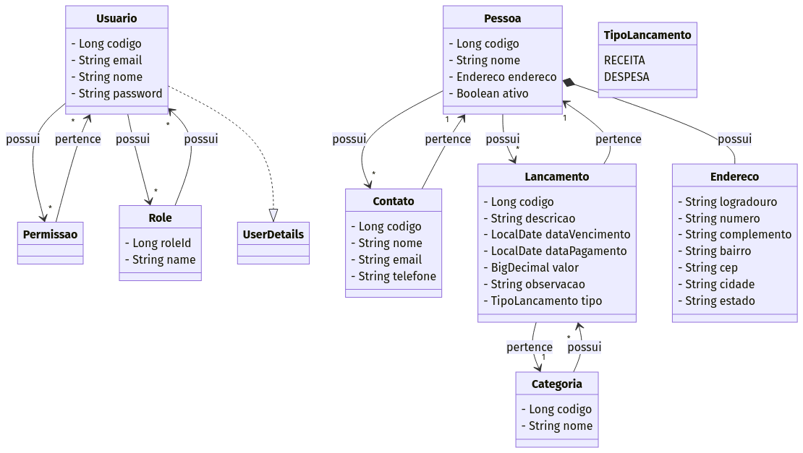

 #  Algamoney


## 📑 Índice

<div align="center">

| 🌟 Essenciais                          | 🛠️ Desenvolvimento             | 📚 Documentação                  |
| -------------------------------------- | ------------------------------ | -------------------------------- |
| [📋 Sobre](#sobre)                     | [💻 Tecnologias](#tecnologias) | [📖 API](#api)                   |
| [⚙️ Funcionalidades](#funcionalidades) | [📦 Requisitos](#requisitos)   | [🤝 Contribuição](#contribuindo) |
| [🎯 Objetivos](#objetivos)             | [🔧 Instalação](#instalação)   | [📄 Licença](#licença)           |

</div>

## Sobre

Algamoney é uma aplicação web de gerenciamento financeiro pessoal que permite aos usuários controlar suas finanças de forma eficiente e segura. O sistema oferece funcionalidades para cadastro de receitas, despesas, gerenciamento de pessoas, relatórios e dashboard.

### Objetivos

- Fornecer uma interface intuitiva para gestão financeira
- Facilitar o controle de receitas e despesas
- Permitir o gerenciamento de pessoas e categorias
- Fornecer relatórios e estatísticas
- Fornecer notificações

#### Diagrama de classes


### Diferenciais

- Interface moderna e responsiva com TailwindCSS
- Autenticação segura com OAuth2 e JWT
- API RESTful documentada com Swagger
- Sistema de notificações com Toastr
- Utilização de JasperReports para relatórios
- Utilização de Thymeleaf para templates
- Visualização de dashboard com estatísticas usando Chart.js

## Tecnologias

### Backend

- Java 17
- Spring Boot 3.2.5
- Spring Security
- Spring Data JPA
- PostgreSQL
- Flyway para migração
- Lombok
- Swagger
- JWT
- JasperReports
- Thymeleaf


### Frontend

- Angular
- TailwindCSS
- NGX-Toastr
- Font Awesome
- Angular JWT
- Animate.css
- Chart.js
- Luxon

## Funcionalidades

### Autenticação

- Login de usuários
- Autenticação JWT

### Lançamentos

- Cadastro de receitas e despesas
- Categorização
- Pesquisa de lançamentos
- Status de pagamento

### Pessoas

- Cadastro de pessoas
- Endereçamento
- Cadastro e listagem de contatos
- Status ativo/inativo

### Relatórios

- Relatórios de lançamentos
- Exportação para PDF

### Dashboard

- Dashboard com estatísticas
- Visualização de relatórios

### Notificações

- Envio de agendamentos para o email do usuário do sistema de lançamentos

## Requisitos

- Java 17+
- Node.js 18+
- PostgreSQL 12+
- Maven 3.6+

## Instalação

### Backend

1. Clone o repositório:

```bash
git clone https://github.com/JamesonHenrique/Algamoney.git
cd algamoney
```

2. Configure o banco de dados PostgreSQL no arquivo `src/main/resources/application.yml`

3. Execute o backend:

```bash
mvn spring-boot:run
```

O servidor estará disponível em `http://localhost:8080`

### Frontend

1. Navegue até a pasta do frontend:

```bash
cd algamoney-ui
```

2. Instale as dependências:

```bash
npm install
```

3. Execute o frontend:

```bash
npm start
```

A aplicação estará disponível em `http://localhost:4200`

## API

A documentação da API está disponível através do Swagger UI:

```
http://localhost:8080/swagger-ui.html
```

### Principais Endpoints
- `/auth` - Autentificação geral
- `/login` - Logar no sistema
- `/register` - Registrar um novo usuário
- `/pagina-nao-encontrada` - Página de erro 404
- `/lancamentos` - Gerenciamento de lançamentos
- `/pessoas` - Gerenciamento de pessoas
- `/categorias` - Gerenciamento de categorias
- `/dashboard` - Dashboard
- `/relatorios` - Relatórios

## Contribuindo

1. Faça o fork do projeto
2. Crie sua feature branch (`git checkout -b feature/NovaFeature`)
3. Commit suas mudanças (`git commit -m 'Adiciona nova feature'`)
4. Push para a branch (`git push origin feature/NovaFeature`)
5. Abra um Pull Request

## Licença

Este projeto está sob a licença MIT - veja o arquivo [LICENSE](LICENSE) para detalhes.

---

<div align="center">

Se este projeto te ajudou, considere dar uma estrela!

[ Voltar ao topo](#Índice)

</div>
